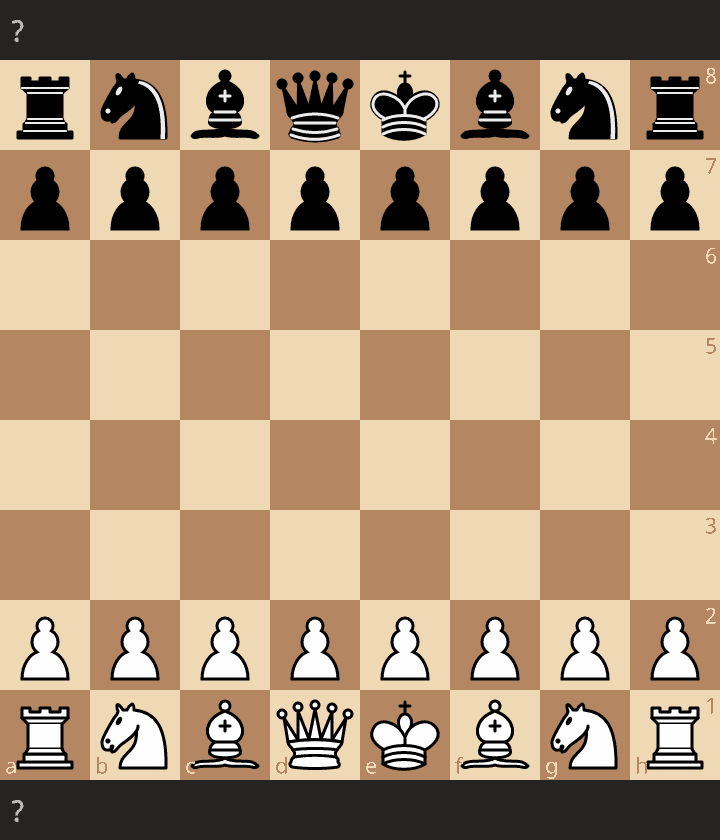

# ♟️ Chess Engine
Chess engine i PyTorch, trent opp data fra proffspill. Datasett fra https://database.nikonoel.fr/ 

Resultat:
- Modellen er trent opp på 561 proffspill. 
- Med 50 epochs tok det ca. 30 min å trene modellen på de 561 proffspillene (brukte kun CPU'en, raskere hvis du klarer å bruke GPU'en). 
- Jeg kan lite om sjakk, men virket som modellen var god i early- og mid-game, men fryktelig dårlig i late-game.
      - dette er nok fordi den får trent masse på early games som er relativt like, men ingen late-games er like og den vet da ikke hva den skal gjøre.
      - leste at man burde bruke dyp reinforcment learning (DRL) for å få bedre late-game

Eksempelspill: bot'en spiller mot seg selv

  

Modellens oppbygning:
- Spillene modellen trenes på lagres som et objekt av typen Game fra chess-bibloteket. 
- Bruker konvolusjonsbasert nevralt nettverk (CNN) med 2.631.136 trenbare parametere.
- CNN fordi den passer på data som har romlig struktur, slik som et sjakkbrett

Jeg fulgte guide fra https://github.com/Skripkon 
